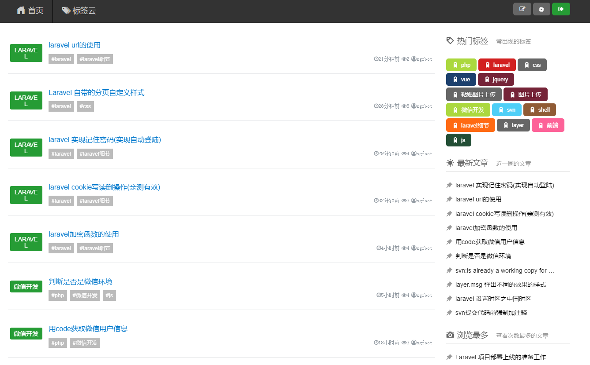
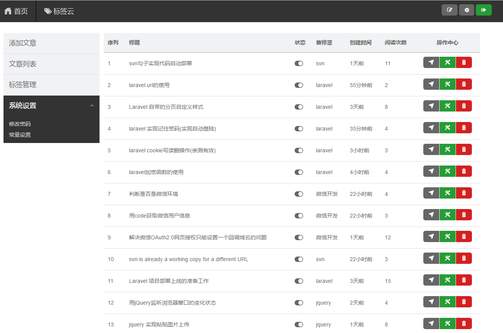

# 百里轻博客

## 定位:轻博客
* 主打轻博客,没有臃肿前台和后台
* 全站以标签进行分类检索
* 首标签精准定位相关博客
* pc,手机端兼容

## 版本更新
[更新动态](changelog.md)

## 依赖插件 
> 感谢如下优秀的框架

1. 前端框架:[http://www.diquick.com/](http://www.diquick.com/)
1. 弹窗layer [http://layer.layui.com](http://layer.layui.com)
1. jQuery 3.2.1
1. Vue 2.x [https://cn.vuejs.org/](https://cn.vuejs.org/)
1. editormd [http://pandao.github.io/editor.md/](http://pandao.github.io/editor.md/) 

## 演示
```angular2html
http://blog.test.sgfoot.com
帐号:test
密码:test(请勿修改密码)
```


## 安装
```php
composer -vvv update
cp .env.example .env
php artisan key:generate
php artisan migrate:refresh --seed
php artisan optimize #类映射加载优化
```

## 效果

